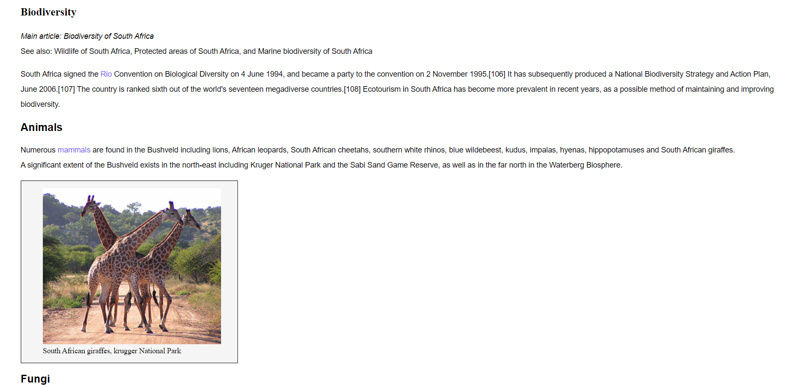
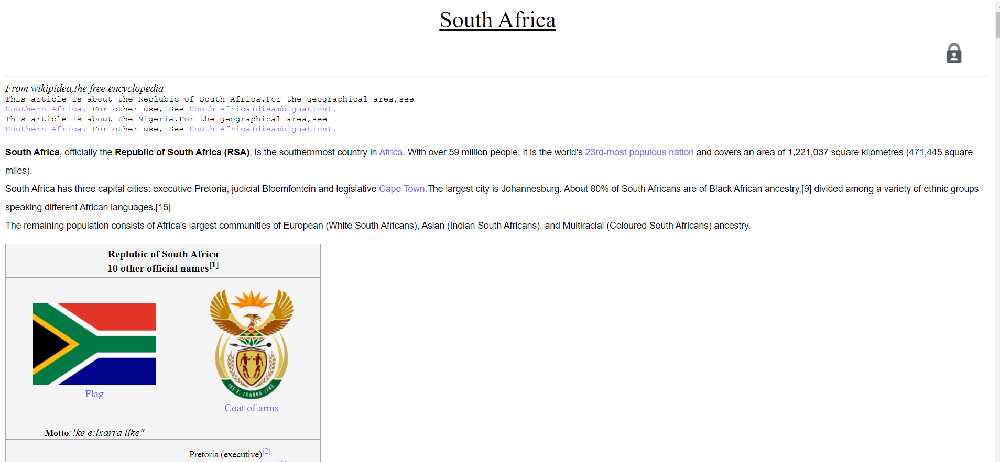
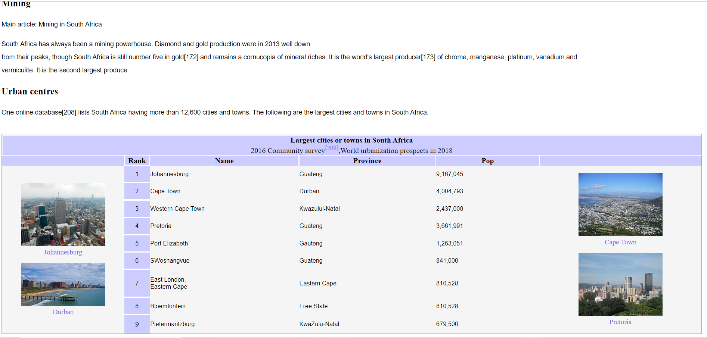
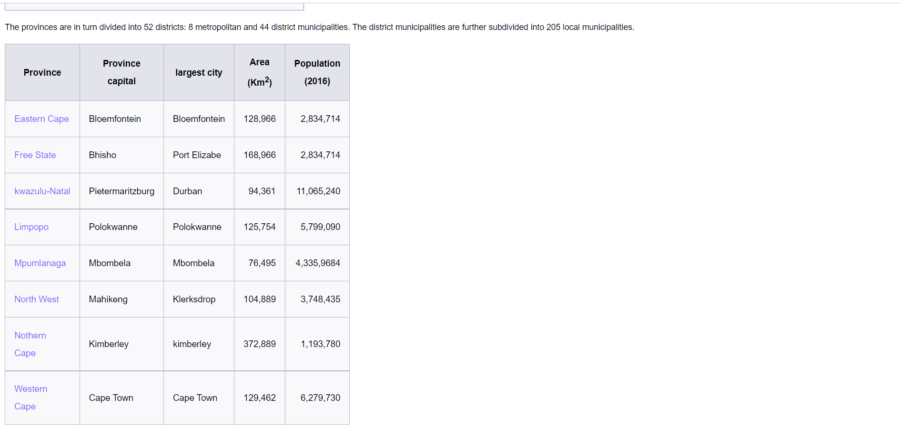

 ## South-Africa Cloned Wikepedia Page.[https://en.wikipedia.org/wiki/South_Africa]    

 # Welcome!

 Thankyou for checking this work. 

 ##ABOUT THIS WORK:
     This is a cloned page from [google.com], to checkout and test my adequate understanding on basic html(Hypertext Mark-up Language) being backed up with little css knowledge for the background styling.

 ## pictures, pictures, pictures
 

                                          
            
   ##process##           
            THIS FILE IS FOR PRACTISE OF BASIC HTML
            
         OVERVIEW(/.html/)
         - PRACTISE MAKING OF COMPLEX TABLES, TABLES WITH CONTENT, PICTURES ,LINKS.
         - PRACTISE HOW TO USE THE COLS AND ROL SPAN IN COMPLEX TABLES
         - THE USE OF LINK TAGS
         - PRACTISE SEMANTIC ELEMENTS, HEADERS, AND PARAGRAPH TAGS.
     

                                          
         
          OVERVIEW(/.css/)
         - PRACTISE DESIGNING OF COMPLEX TABLES, TABLES WITH CONTENT, PICTURES ,LINKS WITH COLORS
         - PRACTISE HOW TO USE THE LINEHEIGHT AND BASIC ADJUSTMENT OF WIDHT AND SIZES.
         - THE STYLING OF LINK TAGS, AND FAMILY.
         - PRACTISE ON HOW TO USE FRONT SIZE TO ENSURE BEAUTIFUL AND MEANINGFUL LAYOUT OF WEBSITE.            

   ## Built with         
      -HTML(Hypertext Mark-up Language)
      -CSS(Cascading Styles Sheet)

   ## My Challanges and lessons
   Learnt how to re-size pictures with px firstly, used my fontsizes well, my border-box saga, which was dealt with, and also the entire structure of a Webpage. It was intersting.
            
   ## Installations
   -For those Farmiliar with Git-hub you can clone the repo and pull to your local workplace to view.
   -For those who ant to view you can download the file from here [https://jmp.sh/r6lQatu], to view Thank you once again.
            

   ## Resources that helped ##
   -For the Colors[https://coolors.co/palettes/trending/blue]
   -For the icons[https://fontawesome.com/v5.15/icons/instagram?style=brands]
   
   ## Best syntax Used
   ``HTML
   (

 tags) and the ( tags).
   ``the Paragraph and link tags.
   

    ``CSS
   (border-colapse) and the ( tags).
   padding and border-collapse; which were both for the spacing(internal) and line around my table section(Those with double lines especially).
   ``
   
   ## Resources that helped ##
   -For the Colors[https://coolors.co/palettes/trending/blue]
   -For the icons[https://fontawesome.com/v5.15/icons/instagram?style=brands]

   ## Licsense 
   This work is under [MIT] liscence. It's highly free and opensource to anyone.

            
 
         
